`ps：xt5`

# 2 富士相机拍照和录视频技巧

## 2.1 富士相机小技巧设置

### 2.1.1 无法开启DR400

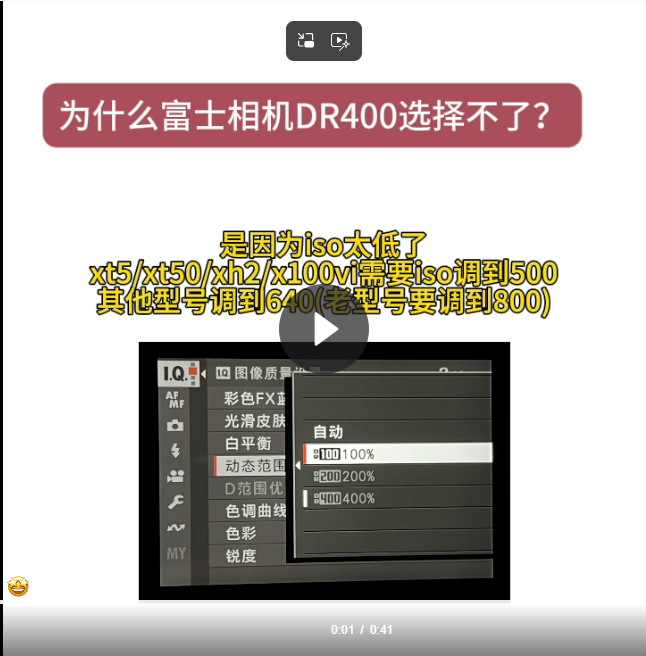

### 2.1.2 色调曲线无法选择

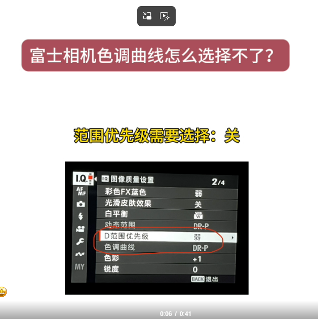

### 2.1.3 相机提示高温发热

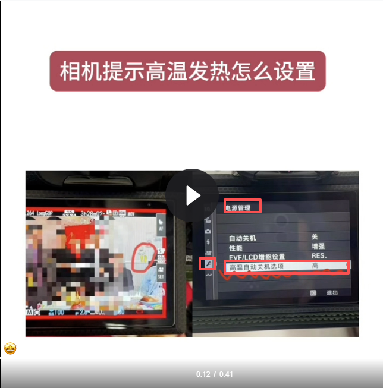

### 2.1.4 相机用电快

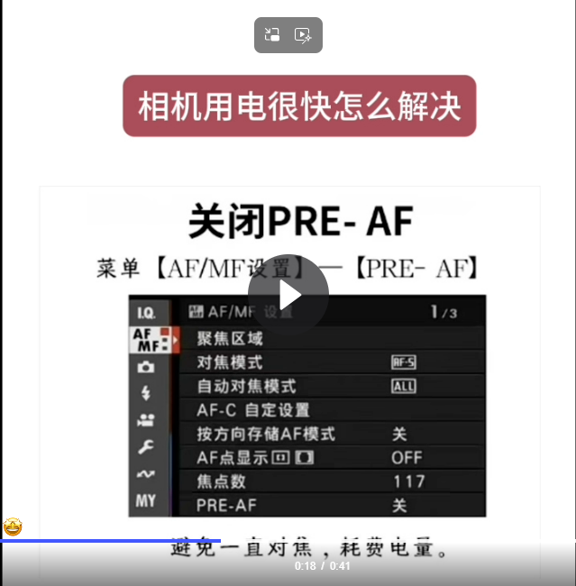

### 2.1.5 屏幕和导出来的图不一样

### 2.1.6 设置相机屏幕亮度

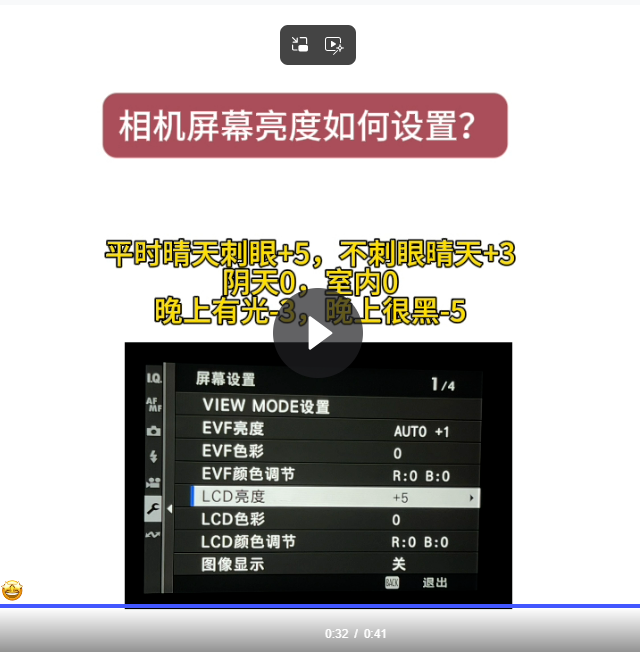

拍照模糊跑焦

对焦模式修改：在相机机身正面、镜头卡口的左下方，有一个标有 **S、C、M** 的拨杆。

### 2.1.7 屏幕没有出现辅助信息

屏幕旁边的disk/back按钮，点这个就可以切换。

## 2.2 屏幕和导出来颜色不一致解决方法

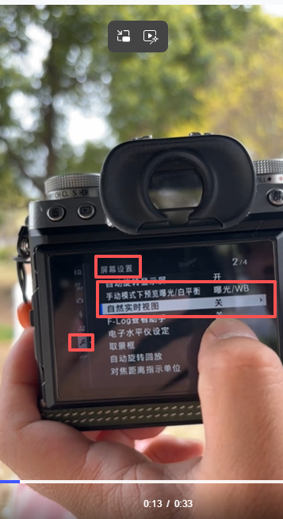

如果是苹果手机：

设置 - 电源管理 - EVF/LCD增能设置 - EVF/LCD分辨率优点

## 2.3 富士相机如何调整曝光值

p/a档模式下，直接调整曝光转盘

m档下，通过快门速度调节，老师的推荐的是快门设置为T，然后通过屏幕右上方波轮调节快门速度，同时可以下图的曝光值在同时变化

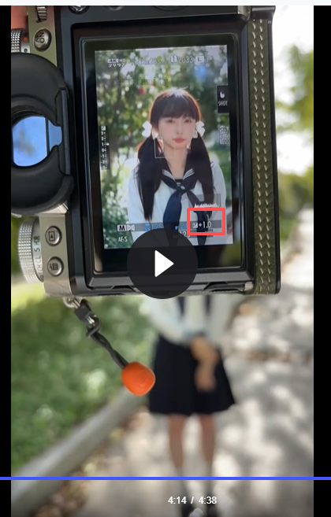

## 2.4 相机直方图怎么看

正常光线，直方图是靠中均匀分布的，左右晃动也是正常的 

过曝，直方图靠右凸起

太暗，直方图靠左凸起

## 2.5 RAW机内处理

图像质量必须选择 F+RAW，拍好图片后，按屏幕右上角的Q，然后选择参数，再按一次Q就确定修改了

## 2.6 - 2.8 no

# 3 富士相机通用参数

## 3.1 泛焦镜头+闪光灯（富士仿ccd）拍照 no

## 3.2 NC滤镜通用参数

色彩效果：弱

蓝色fx：弱

白平衡：白色优先

白平衡偏移：r-2 b+2

动态范围：DR400

色调曲线：h-2 s-2

色彩：+1

## 3.2 CC滤镜通用参数

色彩效果：弱

蓝色fx：弱

白平衡：白色优先

白平衡偏移：r 0 b-1

动态范围：DR400

色调曲线：h-1 s-2

色彩：+1

## 3.2 柔和滤镜（仿佳能）通用参数 no

# 4 曝光三要素和档位的使用

## 4.1 自动挡（p/a)

p档：全部调到a就是自动挡，然后通过曝光补偿就可以调整照片的亮度

a挡：除了光圈全部调用a就是光圈优先档，也可以通过曝光补偿调整照片的亮度

## 4.2 m挡

全部手动就是m挡。

光圈：一般调到最大（数字最小）虚化最强

iso：500

快门：t。然后去转屏幕右上角的齿轮转盘

通过快门速度调整曝光，这个时候曝光转盘已经没有用了。快门越快 -- 亮度越低

## 4.3 光圈的底层逻辑

数字越小  -- 光圈越大  -- 虚化越强

## 4.4 快门的底层逻辑

快门快一点（500以上）就可以拍到运动的东西

为了拍清楚图像，有个安全快门：焦段 * 1.5（也就是最低必须是这个，不然画面就会糊）

331.4的安全快门为50

## 4.5 iso的底层逻辑

iso越低 -- 画质越清晰 -- 噪点越少

但是为了dr400的动态范围，需要调到iso500，画质也不会受太大影响。

# 5 白平衡和色彩偏移使用

## 5.1 富士相机不同白平衡的使用思路

拍人一直用白色优先，这样可以避免环境对人物的影响。（初学就一直用白色优先即可）

一定不要用自动

环境优先，让人受环境影响，要氛围感使用

## 5.2 白平衡和色温的底层逻辑

相机和自然界的色温调整是相反的，因为相机是为了矫正自然界的色温。

白平衡里面的色温（就是k值）

- 白平衡数字越低 -- 色调越冷
- 白平衡数字越高 -- 色调越暖
- 5500是中间色（日光）

## 5.3 白平衡偏移的使用思路

​	蓝色

绿色 	红色

​	黄色

绿色：日系清透

蓝色：冷色

红色：复古

黄色：胶片

举例：在晴天，（复古就用nc，清透就用cc）

我想在cc上加一点复古，就往红色偏移；我想日系风多一点，就往绿色偏移

## 5.4 富士相机如何直出的底层逻辑

照片的组成：光影 + 色调

当照片的颜色不够，比如偏灰，就增加色彩

天空泛白，地上影子很黑，添加冷色调，蓝色fx设置成强（蓝色就是冷色调）

肤色是灰色，中间调。

想要画面有通透感，通过色调曲线高光阴影，dr400来调节。

如果头发很黑，脸很白，全部设置成灰色就好很多了。

- 白平衡决定图片主色调（偏冷偏暖）
- 色彩效果 蓝色fx 色彩决定色彩需要那么深的颜色（颜色鲜艳或者变淡）
- 动态范围 色调曲线决定明暗关系（比如头发很黑，脸很白，对比多于明显）

## 5.5 富士相机色彩直出的底层逻辑

晴天的白平衡为5000 -- 5500k。要暖就加，要冷就减。

# 6 机内参数的理解和使用

## 6.1 颗粒效果

拍人/风景不要用

拍人文，比如一个老爷爷的沧桑感才会用

颗粒效果越高，噪点越多

## 6.2 色彩效果

色彩效果越强 -- 红色增强（红色会更加深）

拍人一般用弱，除非拍出来还是没有颜色，才改成强。

用途：拍花 拍人

## 6.3 彩色fx蓝色

用途：天空 大海

拍的天空/大海不够蓝，增强蓝色fx。

## 6.4 光滑皮肤

磨皮的效果。不要用，富士的磨皮效果感觉很假，后期自己修图磨皮即可。

## 6.5 白平衡

一般用白色优先：让人和景优先还原白色的内容

## 6.6 动态范围

过曝，一般都用DR400。比如人拍白了，旁边有白色的环境就可能更白，所以需要DR400来调节。iso为500就可以使用dr400了。

## 6.7 D范围优先级

加强版的动态范围，不要用，这个拍出来的图片很假

## 6.8 色调曲线

高光：最亮的地方（太阳晒到的地方）

阴影：太阳没晒到的地方

高光升，亮的地方更亮了

阴影升，阴影的地方更暗了

一般高光-2阴影-2，那么画面就会比较柔和，拍人默认就这个。（就可以减少光比很明显，比如头很黑的情况）

## 6.9 色彩

色彩就是照片的颜色，一般都是+1。

如果值很小照片就会发灰，太强了就是对比很明显，比如树就是直接发绿了。

一般+1，要是还不好看就+2就可以了，如果+2都还不行，就要考虑是不是应该换个地方拍照了。

## 6.10 锐度

锐度就是清晰度，照片的细节明显。

锐度高，照片就会很硬。

拍人就用0，风景锐度+1可以让风景更加立体。

## 6.11 高iso降噪

iso高减少噪点，但是会导致画质由很强的涂抹感。白天就是0，晚上降噪+1，用闪光灯-4

## 6.12 清晰度

永远不要用

# 7 胶片模拟的理解和使用

标准：没有胶片模拟的颜色，没有偏色。

柔和：很像佳能，拍人像，鲜花、绿树、蓝天，画面比较柔和。有时发现nc拍出来，人黑了，就可以使用柔和。

鲜艳：只适合风光和吃的，会有很强的对比度。

cc：颜色没有那么深，每个颜色就比较偏中间调，就是有点偏灰。暗部会比较黑，所以需要阴影-2，高光无所谓（清新清透）

nc：绿色在比较暗的地方变成蓝绿色，颜色很深就是因为这个。nc会导致人脸偏洋火，所以加曝光，但是这会导致对比度下来了，所以需要调节白平衡

nn：适合怀旧，比如香港人像，就像一个80年代香港照片

etrna：灰片，很像是灰白照片。

# 8 对焦模式的选择和使用

## 8.1 各种对焦模式的详细用法

镜头旁边的按钮c-连续对焦 s-单次对焦 m-手动对焦。

- 当拍摄运动物体或者抓拍就用c
- 摆拍就用s

## 8.2 拍运动物体的对焦设置（小孩或鸟）

设置成af-c，同时iso转盘下面按个波轮选择CL（低速连拍**Low-speed Continuous Shooting**）。

## 8.3 对焦的详细设置（尤其是运动物体）

让镜头自动对焦运动的物体：

- 打开pre-af
- 打开眼部识别

# 9 不同光线的摄影教程

## 9.1 自然界光线的运用

无笔记

## 9.2 侧光站位的讲解

拍人，避免侧光。很导致人脸一半亮一半暗。

技巧：影子在模特左右两边，就说明是测光

## 9.3 逆光站位的讲解

**踩影子大法**

顺着影子的方向去拍人，背景选择暗一点的，不要对着白天。拍摄发光光丝还是很不错。

背景选择暗的原因是，逆光下人脸是黑色，我们需要调整曝光到1左右，就可以让人脸亮了，背景因为是暗色，所以也不会过曝。

## 9.4 顺光站位的讲解

顺光下拍人会过曝，不要顺光

## 9.5 实拍效果和站位技巧

不需要一定站在影子上，在影子这个方向就可以了，也不一定要和影子在直线上，有一点点偏也可以。

## 9.6 顶光实拍效果和站位技巧

太阳很大，逆光拍也会导致头部会比脸更亮。

在纯阴影下拍照，人物也比较黑，毫无晴天拍照的感觉了，也不行。

站到树叶遮挡部分光的下面，这样人物也不是很黑，也有阳光照到头发上。注意背景也要暗一点。

# 10 基础构图

## 10.1 三分构图

把人放到左或右的三分线上，把另外一边留给景色，适合景色好看的。

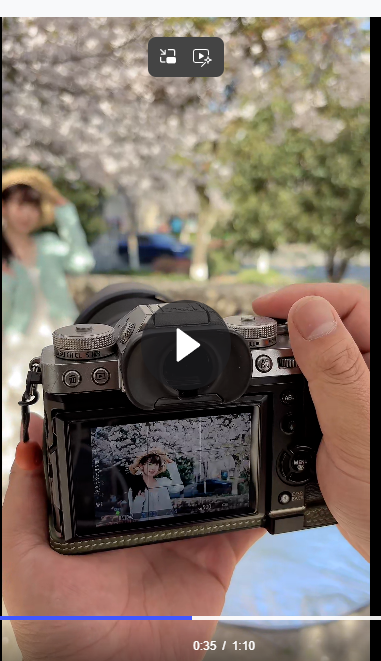

## 10.2 引导线构图

人物背后有个石墩，很突兀

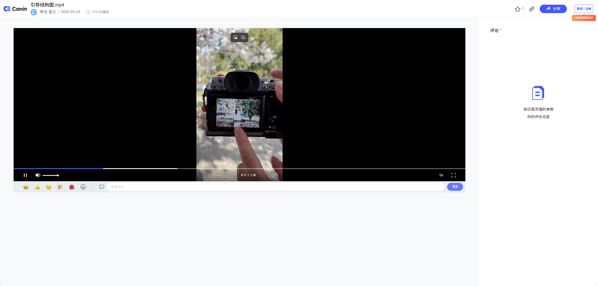

把突兀的东西，当做一个引导线。

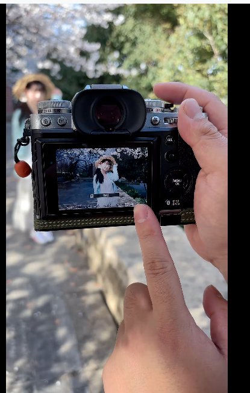

当拍摄一个背景很普通时，就可以尝试从旁边来拍摄这个画面。看上面其实也是个中心构图，没有强行三分构图，也是挺好看的。

## 10.3 中心构图

眼睛在最上面一根线上下。

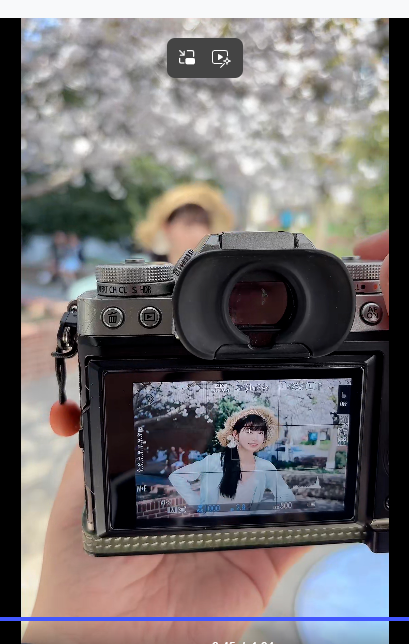

## 10.4 创意构图

利用前景让画面更有层次感。

如下很平淡：

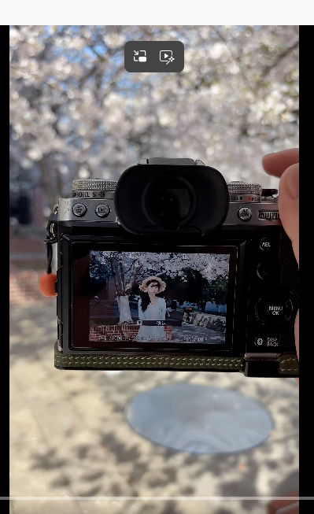

前景不要挡住人，一般不要超过最边的那根线：

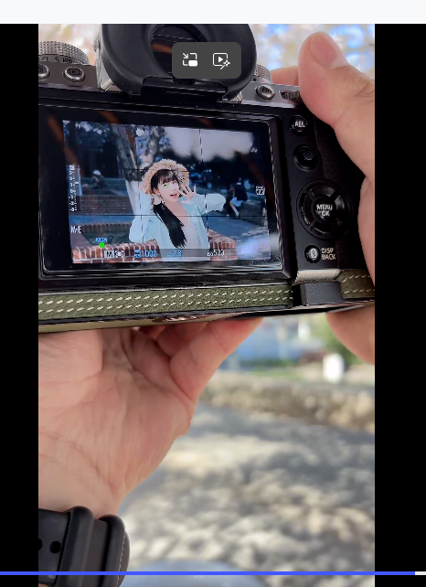

# 11 镜头的搭配与选择（no）

# 12 反光板/ 闪光灯/ 补光灯使用

