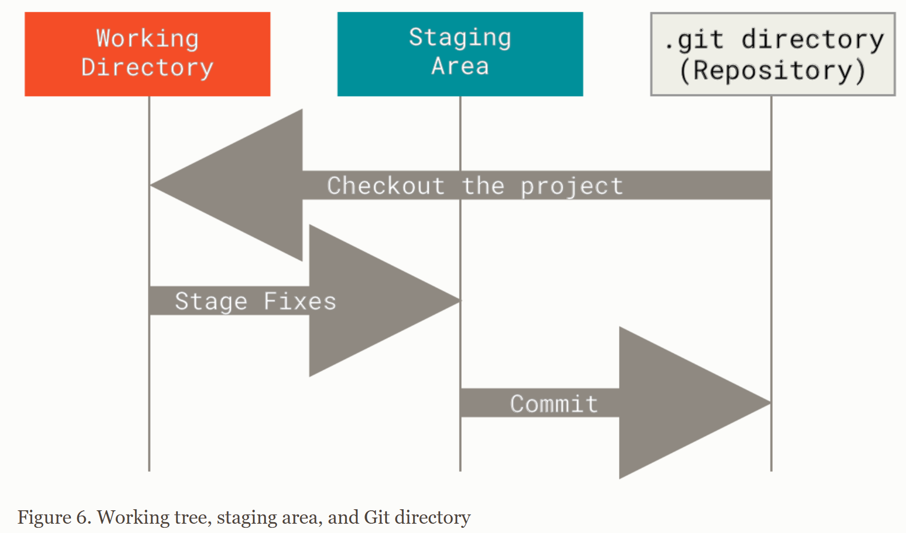

# 1. Getting Started

## 1.1 Getting Started - About Version Control

### About Version Control

#### 什么是vcs（version control system）

- vcs是记录文件跟随时间的改变的系统
- 用户可以将文件回退到指定版本

### Local Version Control Systems

#### 最笨的vcs方案

手动拷贝文件，然后通过时间戳命名

- 优点：简单
- 缺点：很容易忘记当前的文件处于什么状态，然后拷贝了错误的文件（error prone）

#### 本地vcs

使用数据库跟踪文件的修改。比较知名的就是RCS，通过维护一个补丁集实现重新创建新文件（从而间接实现回退功能）

- 优点：通过数据库保存补丁，不容易搞错文件的状态
- 缺点：无法多人合作开发

### Centralized Version Control Systems

#### 集中式版本控制系统

被版本控制的文件被中心服务器集中管理，客户自由检出文件的快照（也就是客户端只能从服务器更新文件，本地是没有完整的历史的）。

- 优点：客户知道其他人在做什么部分；管理员可以进行细粒度的控制每个人可以做什么
- 缺点：
  - 如果中心服务器故障，所有人都无法合作开发并保存本地的修改。
  - 一旦磁盘损坏，直接数据全没了，只要是把所有数据集中管理，就会出现这个问题。

### Distributed Version Control Systems

#### 分布式版本控制系统

完整镜像仓库，包括仓库的所有历史。

- 优点：
  - 即使中心服务器故障，也可以使用本地仓库向上恢复
  - 本地仓库还可以连接多个远程仓库，从而在同一个项目上开启不同的工作流

## 1.2 Getting Started - A Short History of Git

### git的核心标准：

- 快
- 设计简单
- 并行开发
- 分布式
- 能够处理大项目

ps：现代项目基本上都要求这些标准:)

## 1.3 Getting Started - What is Git?

### Snapshots, Not Differences

#### 传统vcs和git的区别

- 传统vcs：将修改保存为文件集，所以又称为基于增量的版本控制
- git：提交时保存文件快照，并保留一个快照的引用。如果用户没有对文件修改，则直接引用到之前的快照上

### Nearly Every Operation Is Local

#### 离线状态下git的优势

1. 直接本地完成读取历史、差异比较等操作
2. 即使离线，仍然可以正常提交
3. 没有网络延迟，大部分操作几乎都是瞬时完成

### Git Has Integrity

#### git的完整性由什么确定

git内部所有东西都通过被校验和计算，然后通过校验和来引用。

作用：通过检验和git可以知道所有文件的状态改变，所以符合git哲学 -- 用户不会再git没有检测到的情况下丢失任何信息。

### Git Generally Only Adds Data

#### git保护数据的方式

git几乎只是添加数据，即使用户做的事一个删除操作或者回退到之前的版本。

### The Three States

#### git的三个状态

- modified：文件被修改但是没有提交到数据库
- staged：标记文件将在下一次提交中被提交到数据库
- committed：文件被安全提交到本地数据库

#### git项目的三个部分

- Working Directory：项目某个版本的签出，从git数据库中拉出文件并放置到磁盘上。
- Staging Area：一个文件，用于保存什么将会进入下一次提交。
- Git Directory：存储项目的元数据和对象数据库，当执行clone操作时，就是克隆的git目录。



## 1.4 Getting Started - The Command Line

### The Command Line

#### 使用git的方式

- 命令行：所有命令都支持。
- 图形化界面：常用的都支持。

推荐：

- 实际项目用图形化界面，因为解决冲突更加简单。
- 学习使用命令行，因为学习了命令行，使用图形化界面就是易如反掌，反之就不是了。

## 1.5 Getting Started - Installing Git

：）

## 1.6 Getting Started - First-Time Git Setup

### git config配置

- --system：在[path]/etc/gitconfig；影响整个系统
- --global：在~/.gitconfig或者~/.config/git/config；影响当前用户
- --local（默认）：git仓库中的.git/config；影响当前仓库

### git读取配置的顺序

local > global > system

### Your Identity

#### 安装git后需要马上配置身份信息

需要配置用户名和邮箱，因为git提交时需要这些信息。

```shell
$ git config --global user.name "John Doe"
$ git config --global user.email johndoe@example.com
```

### Your Editor

#### 配置编辑器

windows下需要放置可执行文件的完整路径，linux一般不需要

```shell
$ git config --global core.editor emacs
```

### Your default branch name

#### 设置默认分支名

git默认分支名是master，可以自行设置为main

```shell
$ git config --global init.defaultBranch main
```

### Checking Your Settings

#### 列出配置设置

注解：key就是git的关键字，比如user.name等

```shell
# 列出所有的key和对应的值
$ git config --list
    
# 只列出特定的关键字
$ git config <key>

# 一个key可能多个文件都有配置，让git列出这个值是从哪个文件获取的
git config --show-origin <key>
```

## 1.7 Getting Started - Getting Help

ai时代反正我是不用帮助手册了 ：）

## 1.8 Getting Started - Summary

无

# 2 Git Basics

## 2.1 Git Basics - Getting a Git Repository

### 获取git仓库的方式

- 将本地文件夹转为git仓库
- 从其他地方克隆已经存在的仓库

### Initializing a Repository in an Existing Directory

#### 将本地文件夹转为git仓库

```shell
$ cd /home/user/my_project
# git init会创建一个.git目录，里面现在只是一个骨架，此时没有任何文件被跟踪
$ git init

# 将指定文件放入git版本控制
$ git add *.c
$ git add LICENSE
$ git commit -m 'Initial project version'
```

#### 从其他地方克隆已经存在的仓库

克隆会把服务器上的所有数据全部克隆下来，包括历史记录，所以.git文件夹中是有很多数据的，不会只是一个骨架。

```shell
# 本地会出现libgit2的文件夹
$ git clone https://github.com/libgit2/libgit2

# 将项目clone到不一样名字的文件夹中（不建议）
$ git clone https://github.com/libgit2/libgit2 mylibgit
```

## 2.2 Git Basics - Recording Changes to the Repository